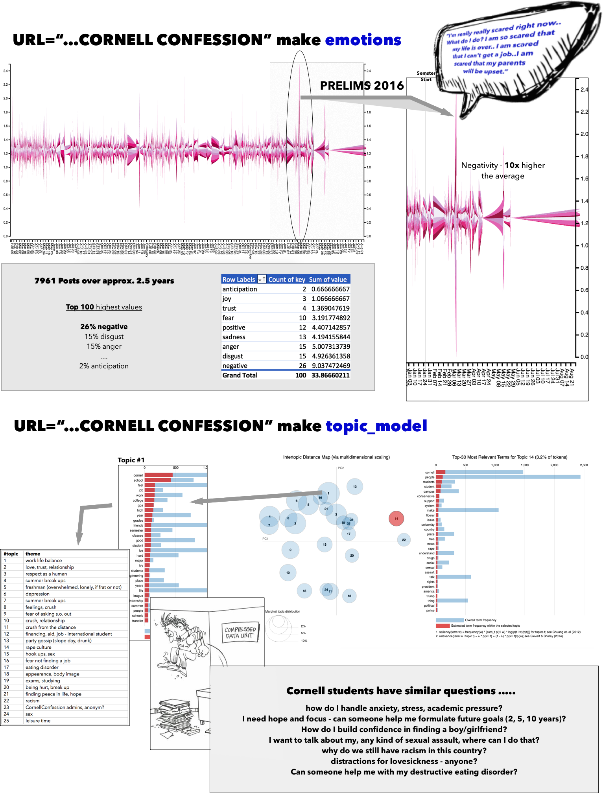

ConfessionScraper Repository
========================

## Installation
The project uses the GNU-Make commands for housekeeping. Please have both GNU Make and Python 2.7 installed and available in the system `PATH`. Additionally, please have the `virtualenv` python package installed.

  '$ make install'

## Workflow
# note: without having scraped data following feature will not be executable: entiment|emotions|topic_models

* Make scrape

  '$ URL={yourURL string here} make scraper'

  e.g. '$ URL='https://www.facebook.com/BigRedConfessions/' make scraper'
  —> creates new directory for the university in data
  —> scrapes all Facebook posts for that side 

* Make sentiment

  '$ URL={yourURL string here} make sentiment'

  —> gets all pos and neg word counts for posts and saves it to output

* Make emotions

  '$ URL={yourURL string here} make emotions'

  —> first, preprocesses the times so they don’t mess up the count later (sometimes two posts have the exact same time - chasing this by adding seconds)
  —> gives back emotions per post

* Make topic_model

  '$ URL={yourURL string here} make topic_model'

  —> preprocesses posts from csv to separate files
  —> preps matrix in R for lda model
  —> exec lda model in a R script

## References
* [LDAvis](http://cpsievert.github.io/LDAvis/reviews/reviews.html)
* [Liwc Dictionary](http://liwc.wpengine.com/)

